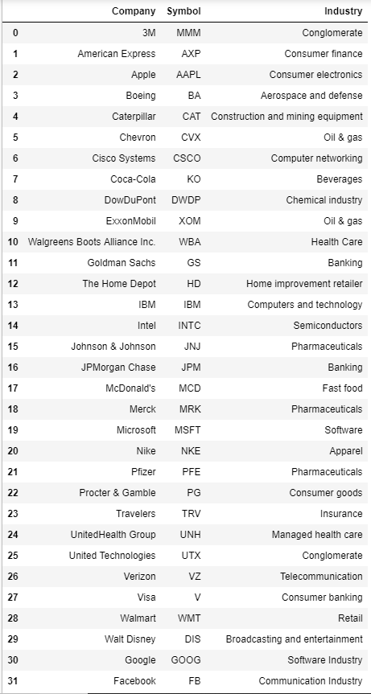
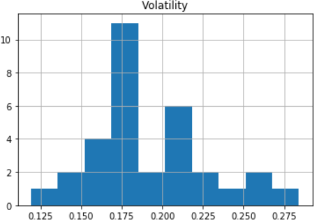
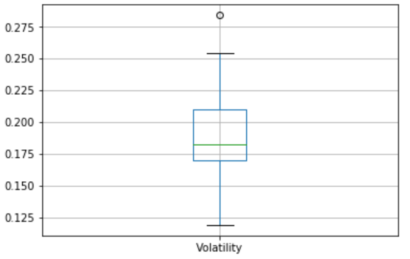
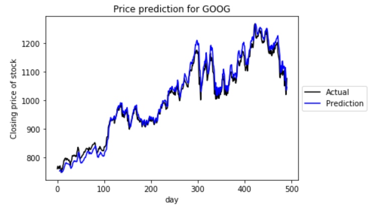
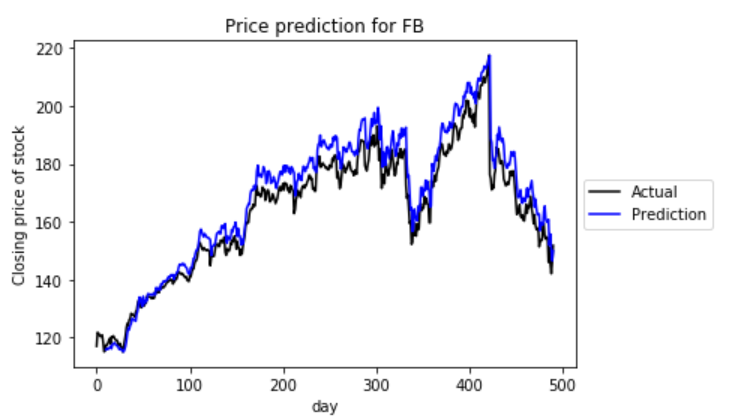
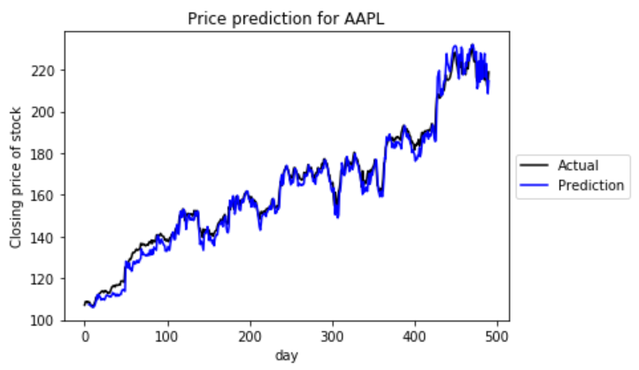
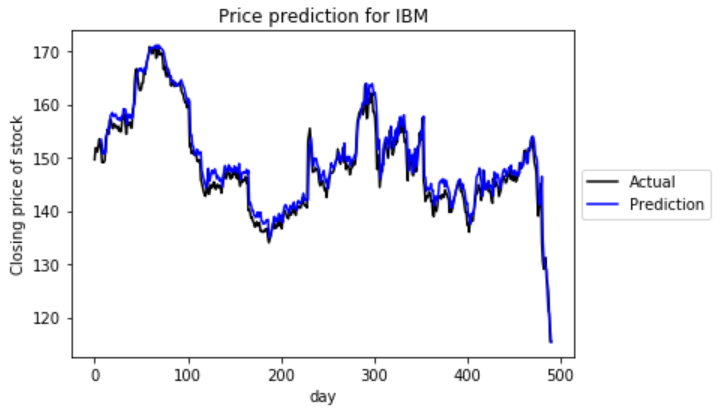

This Project is predicting stocks for 32 companies with error less than 1% using LSTM Networks.
I have not used pre-built models. I have trained LSTM NN models for All 32 companies listed below.
The data considered here is of 2 years for all companies. From (1 Nov,2016) to (31 Oct,2018)

The list of Companies for which we are downloading the data is stored in csv file in data directory
as "dow30.csv".

I have developed the code in following steps:
(1) I have developed the python file downloader.py in data_fetcher directory which 
    is used to fetch stock data of companies from Yahoo Download API.

(2) Then I have written data_creater.py file which contains classes and functions
    to download data, normalize and process data, feature selection, simple sequence, multi sequence,
    draw the graph for predictions etc.
    downloaded data is stored in data directory and inside that, each companies symbol directory.

(3) Then I have visualized the data using prepare_data.ipynb notebook and observed the volatility
    distribution and range as shown below.

(4) model.py is developed after that. This file contains the classes and functions to 
	build the model, select the best model, select the hyper parameters, predict the output,
	show the graph for the output etc.
	This file is using data_creater.py for feature selection and other stuff.

 	We are training our model on different layers of RNNs listed below : 
	(a) Bidirectional LSTM layer (output size based on X input sequence length)
    (b) Fully connected layer (output based on input sequence length)
   	(c) Dropout (based on given dropout rate) 
    (d) Fully connected tanh output layer of 1

    This module also checking for the best combination of learning rate, epochs and dropout and 
    makes final module considering the best hyper parameters.

(5) After building complete model.py, I have developed train_rnn_models.ipynb notebook.
	It trains the model on our Recurrent Neural Network. 
	Also, it checks each and every hyper parameters combination to find the best combination.
	It chooses the best combination for each company and builds the models and stores the models
	in model directory.
	You can check the uploaded notebook.

(6) Then I have developed model_selection.ipynb to select the best model. I have taken one company
    for selection. Company taken here is "Apple". 
    I have trained using different approaches like Simple Sequence and Multi Sequence Analysis.
    Also, I have tried the different combination of window size, epochs, learning rate etc. to pick
    the best model parameters and stored the model at "MMM" directory in model directory.

(7) Then at last, I have developed the python notebook generate_predictions.ipynb to predict the results
	by our model. I have also given options to change the data. If you want to change the data, just go 
	to generate_predictions.ipynb notebook and change the start_date and end_date for the data which it 
	downloads. It will change the data and normalize it.

	It is first picking the company name, it is checking that which model gives the minimum test error
	from the models stored in model directory and then it uses that model for prediction.

	Because it was taking much time, And my PC has computation limits, I have only made predictions for 4
	companies : Google, Facebook, Apple, IBM.
	If you want to make prediction for more companies, add company names in "ticker" list in generate_predictions.ipynb notebook. 
	And if you want to download data for some other companies too, add the symbols and names in "dow30.csv".

	Here are some predictions generated by this project :

